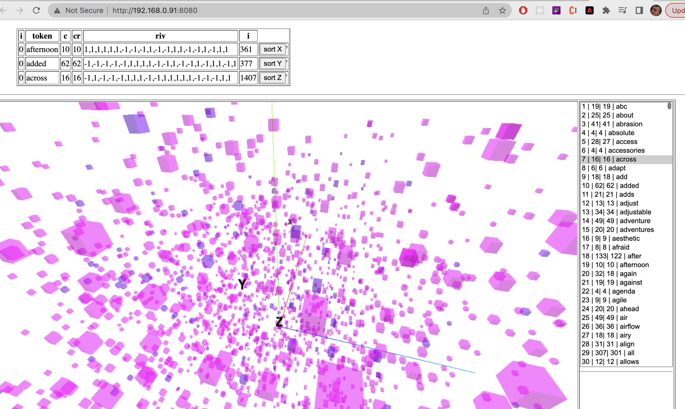

### image


## Setup
Download [Node.js](https://nodejs.org/en/download/).
Run this followed commands:

``` bash
# Install dependencies (only the first time)
npm install

# Run the local server at localhost:8080
npm run dev

# Build for production in the dist/ directory
npm run build
```
# ref_threejs_and_webpack


# Install dependencies (only the first time)
npm install

# Run the local server at localhost:8080
npm run dev

# Build for production in the dist/ directory
npm run build


npm install three-css2drender


# debugging 
https://stackoverflow.com/questions/36783068/cannot-connect-to-the-target-connect-econnrefused-127-0-0-19222

 In a terminal, execute /Applications/Google\ Chrome.app/Contents/MacOS/Google\ Chrome --remote-debugging-port=9222
